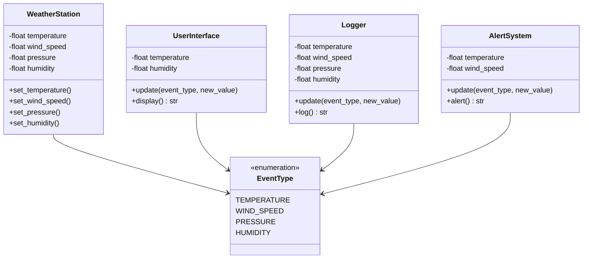

# Practical Assignment: Object Oriented Design Patterns - Observer <!-- omit in toc -->

## Table of Contents <!-- omit in toc -->

- [1. Learning Objectives](#1-learning-objectives)
- [2. Instructions](#2-instructions)
- [3. Deliverables](#3-deliverables)

## 1. Learning Objectives

After the completion of this project you will be able to:

- Implement the [Observer Design Pattern](https://refactoring.guru/design-patterns/observer) to to notify multiple objects about events.
- Apply the Single Responsibility principle.
- Apply the Open/Closed principle.

## 2. Instructions

You are working on a `WeatherStation` class that records data from sensors from a weather station. You are building a web application that listens to events, and updates the `temperature`, `wind_speed`, `pressure` and `humidity` parameters according to the values sensed by the weather station. It then outputs the new values in different formats, visually through the `UserInterface` class, in the form of logs through the `Logger` class and as alerts thanks to the `AlertSystem` class.

Implement the Observer pattern to satisfy the functional requirement described above and make sure that your solution is easily extensible for other subscribers.

## 3. Deliverables

- [SOLUTION.md](SOLUTION.md) explaining your approach, including an UML of your solution.
- Functional code implementing the Observer Design Pattern.
